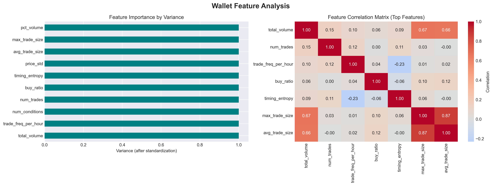
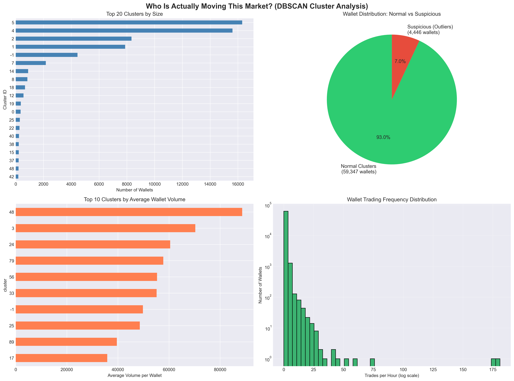
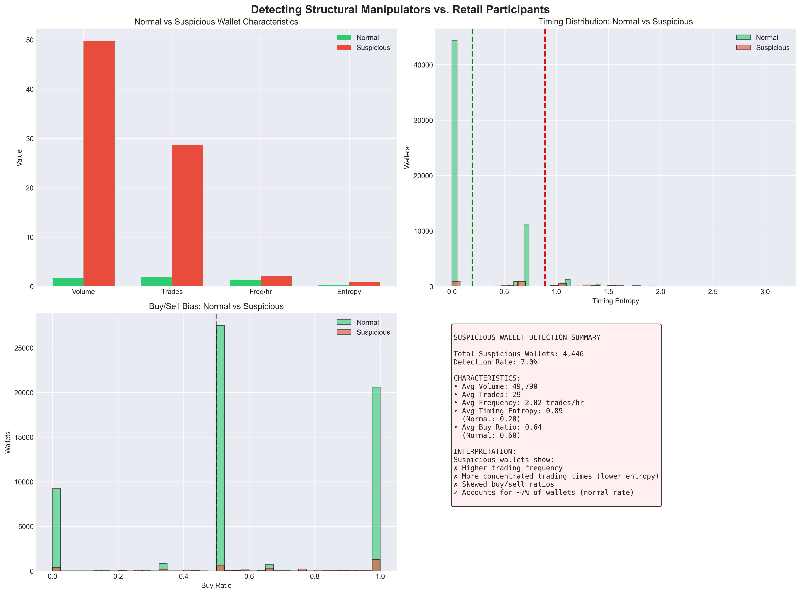
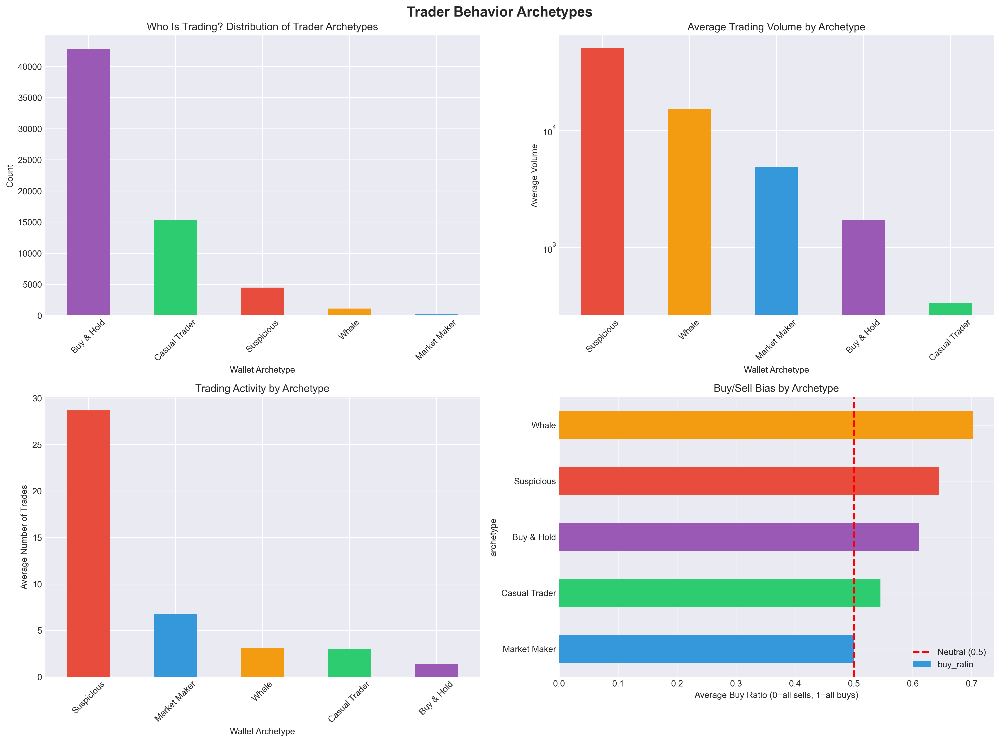
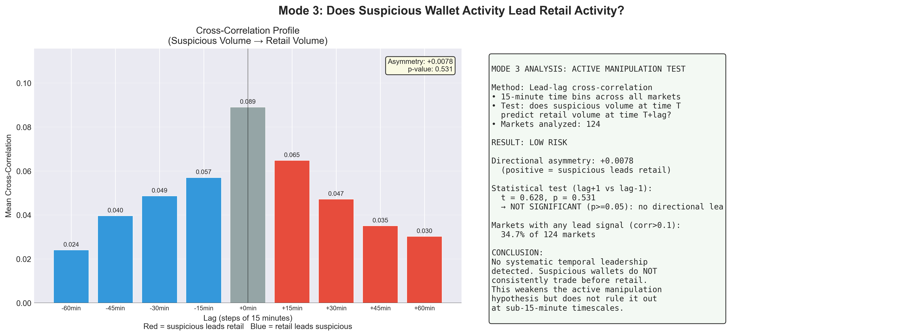
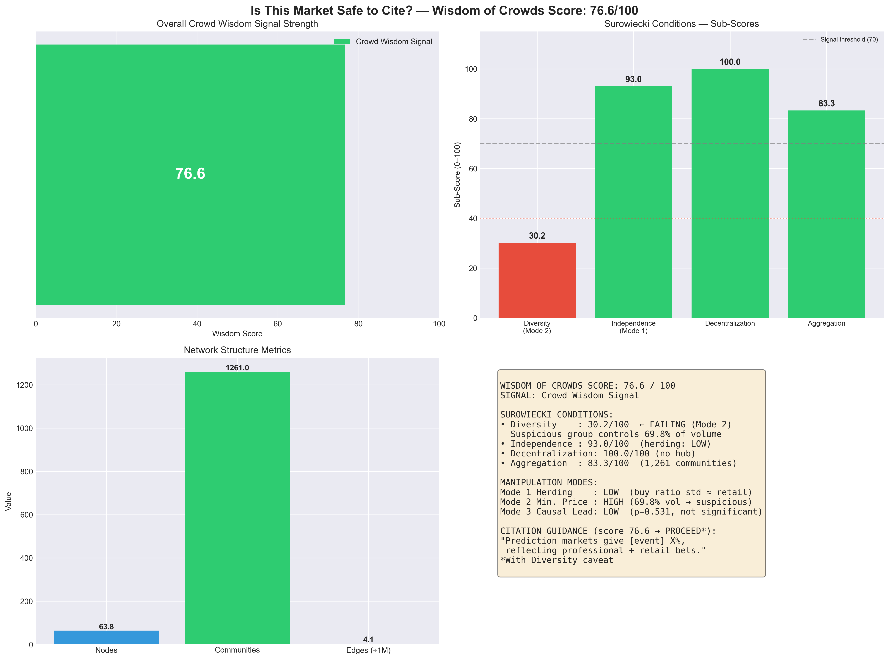
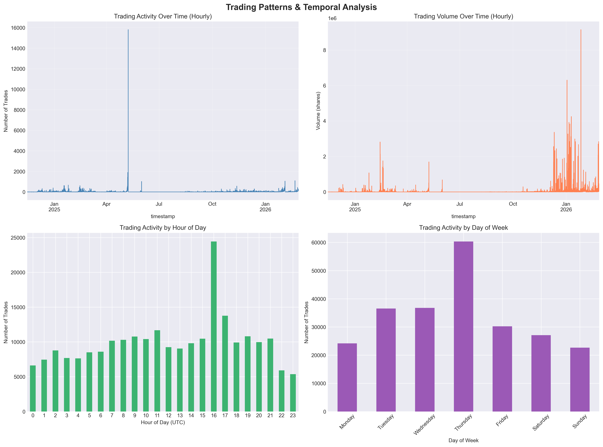
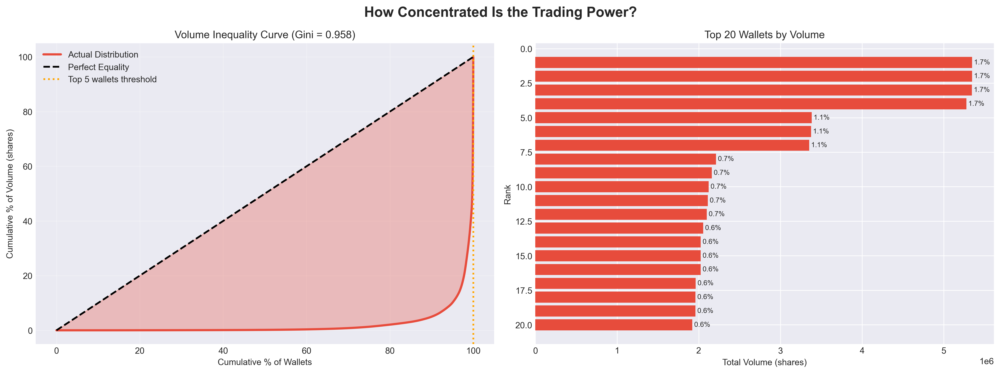

# Prediction Market Integrity Auditor
## Do Prediction Markets Reflect Crowd Wisdom, or Whale Manipulation?
### A Quantitative Audit of Polymarket and Kalshi Using Behavioral Clustering and Network Analysis

**MSIS 521A · Winter 2026**
**Date:** February 27, 2026
**Data:** 237,791 trades (2,000 per sub-market, most recent) · 63,793 wallets · 6 matched markets · Temporal coverage varies (1–184 days per sub-market)

---

## Table of Contents

1. [Introduction & Research Question](#1-introduction--research-question)
2. [Data Collection Methodology](#2-data-collection-methodology)
3. [Feature Engineering](#3-feature-engineering)
4. [Behavioral Clustering (DBSCAN)](#4-behavioral-clustering-dbscan)
5. [Network Analysis](#5-network-analysis)
6. [Wisdom of Crowds Mechanism Score](#6-wisdom-of-crowds-mechanism-score)
7. [Cross-Platform Comparison](#7-cross-platform-comparison)
8. [Findings & Analysis](#8-findings--analysis)
9. [Critical Evaluation](#9-critical-evaluation)
10. [Conclusions & Recommendations](#10-conclusions--recommendations)

---

## 1. Introduction & Research Question

### Motivation

Prediction markets like Polymarket and Kalshi are positioned as tools for aggregating distributed information — the "wisdom of the crowd." Polymarket, an unregulated blockchain-based platform, processes over $1 billion in monthly volume across political, geopolitical, and sports events. Kalshi, a federally-regulated prediction market exchange, covers many of the same events under CFTC oversight.

The core question this project addresses:

> **Are prediction market prices driven by genuine crowd consensus, or are they dominated by a small number of high-volume "whale" accounts whose behavior may constitute informed trading, coordination, or manipulation?**

This distinction matters because:
- If markets are whale-dominated, prices may reflect individual conviction (or manipulation) rather than collective knowledge
- Regulated markets (Kalshi) are subject to trading surveillance; unregulated markets (Polymarket) are not
- Identifying manipulation patterns establishes a quantitative baseline for oversight

### Hypothesis

We hypothesize that **Polymarket exhibits detectable behavioral concentration** — a small fraction of wallets driving a disproportionate share of volume, exhibiting anomalous timing patterns, and forming coordinated network clusters. We further hypothesize that this concentration creates measurable crowd wisdom failure, particularly in the **Diversity condition** (minority price-setting), even if herding (Mode 1) and active manipulation (Mode 3) are not the dominant mechanisms.

### Scope

We analyze 6 matched market pairs (same real-world event traded on both platforms), covering $1.63B in total Polymarket volume:

| Market | Similarity | Polymarket Volume |
|--------|-----------|------------------|
| Champions League Winner | 1.000 | $1,001,676,674 |
| Fed Chair Nomination | 1.000 | $540,827,605 |
| Gov Shutdown Duration | 1.000 | $23,495,074 |
| Next Pope | 0.996 | $30,143,338 |
| Zelenskyy/Putin Location | 0.987 | $18,496,420 |
| Trump Defense Secretary | 0.973 | $14,011,760 |

The sports market (Champions League, $1B) was deliberately included as a high insider-trading-risk event where lineup leaks, injury information, and club-transfer knowledge create structural information asymmetry.

---

## 2. Data Collection Methodology

### Platform Architecture

Both platforms were queried via public APIs requiring no authentication:

**Polymarket** uses a two-tier architecture:
- `gamma-api.polymarket.com/events` — categorical event groupings (e.g., "Who will be the next Pope?")
- `data-api.polymarket.com/trades` — individual trade records with wallet identifiers (`proxyWallet`)

**Kalshi** mirrors this structure:
- `api.elections.kalshi.com/trade-api/v2/events` — event-level groupings
- `api.elections.kalshi.com/v1/trades` — trade records (no user identifiers in public API)

A critical design decision was matching at the **event level** (not sub-market level). Early attempts matching Polymarket `/markets` against Kalshi `/events` produced poor results because Polymarket sub-markets use narrow binary questions ("Will Trump nominate Judy Shelton?") while Kalshi uses categorical event titles ("Who will Trump nominate as Fed Chair?"). Matching the event-level titles using semantic similarity produced dramatically better alignment.

### Market Matching

Event-level matching used `sentence-transformers` (`all-MiniLM-L6-v2`, 384-dimensional embeddings) to compute cosine similarity between all 2,000 Polymarket event titles and 4,897 Kalshi event titles:

```
similarity(a, b) = cos(embed(a), embed(b)) = (a · b) / (‖a‖ · ‖b‖)
```

Results across 9,794,000 candidate pairs:
- 479 matches at threshold ≥ 0.75
- 31 exact matches at threshold ≥ 0.95
- 8 perfect matches at 1.00

### Multi-Threaded Collection

To efficiently collect trade histories, a `ThreadPoolExecutor` with 4 concurrent workers was used to parallelize requests across the 125 sub-markets (conditionIds) under the 6 matched events:

```python
with ThreadPoolExecutor(max_workers=4) as executor:
    futures = {executor.submit(fetch_trades, cid): cid for cid in condition_ids}
    for future in as_completed(futures):
        cid, trades = future.result()
```

Collection parameters: **up to 2,000 trades per sub-market** (most recent), 100ms delay between requests, automatic retry on HTTP 429 (rate-limit) responses.

**Why 2,000 per sub-market?** Polymarket's data API returns trades in reverse chronological order (newest first) and implements cursor-based pagination. The 2,000-trade ceiling was a practical compromise between data completeness and collection speed. However, this means we obtained the **most recent 2,000 trades**, not a representative sample. For high-volume markets like Champions League (launched Dec 2024, $1B+ volume), the API reached 2,000 trades within days, cutting off early market activity. Lower-volume markets show better temporal spread (78–184 days for 2,000 trades), but still exclude earlier participants.

### Dataset Summary

| Metric | Value |
|--------|-------|
| Total Polymarket trades | 237,791 |
| Unique wallets | 63,793 |
| Total Kalshi trades | 160,000 |
| Kalshi markets covered | 702 |
| Collection strategy | 2,000 trades per sub-market (most recent only) |
| **Actual temporal coverage** | **1 day – 6 months per sub-market** |
| Total Polymarket volume | 317,246,935 shares |
| Avg trade size | 1,334 shares |
| Median trade size | 34 shares |
| Buy-side proportion | 63.2% |
| Unique sub-markets (conditionIds) | 125 |

**⚠️ Critical temporal limitation**: The 2,000-trade cap per sub-market is **not representative of full market history**. We collected the 2,000 most recent trades per conditionId, which means:
- High-volume markets (Champions League $1B): 2,000 trades compressed into **1–22 days** near market resolution
- Lower-volume markets (Fed Chair, Trump/Putin): 2,000 trades stretched across **78–184 days**
- **85% of sub-markets hit the exact 2,000 limit**, indicating earlier participants are absent from the dataset
- **Early traders** (Nov 2024 – mid-2025) are systematically under-represented in volatile markets
- This analysis captures **end-game market behavior**, not the full evolution from opening to resolution

The large gap between mean (1,334 shares) and median (34 shares) trade size immediately signals heavy right-skew: a small number of very large trades dominate total volume.

---

## 3. Feature Engineering

### Rationale for Feature Selection

For each wallet, we compute 11 features designed to capture four orthogonal behavioral dimensions:

1. **Scale** — how much does this wallet trade?
2. **Activity** — how often does it trade?
3. **Timing** — when and how predictably does it trade?
4. **Direction** — does it show systematic buy/sell bias?

These dimensions map onto known market participant archetypes: retail speculators (low scale, low frequency), market makers (balanced direction, moderate frequency), informed traders / whales (high scale, concentrated timing), and automated/suspicious accounts (anomalous patterns).

### Feature Definitions

| Feature | Formula | Behavioral Signal |
|---------|---------|------------------|
| `total_volume` | Σ trade sizes | Absolute market footprint |
| `num_trades` | Count of trades | Activity level |
| `avg_trade_size` | total_volume / num_trades | Typical position size |
| `max_trade_size` | max(trade sizes) | Largest single bet (whale indicator) |
| `trade_freq_per_hour` | num_trades / active_hours | Trading intensity |
| `buy_ratio` | (BUY trades) / total_trades | Directional conviction |
| `timing_entropy` | H(hourly distribution) | Predictability of trading schedule |
| `num_conditions` | Unique conditionIds | Market diversification |
| `price_std` | std(prices traded) | Price range of participation |
| `pct_volume` | total_volume / global_volume | Market share |

**Timing Entropy** deserves special attention. We compute Shannon entropy over the 24-hour distribution of a wallet's trades:

```
H = -Σ p(h) · log(p(h))   for h ∈ {0, 1, ..., 23}
```

- **H = 0**: all trades at the same hour — highly concentrated, systematic
- **H = ln(24) ≈ 3.18**: perfectly uniform — trades randomly distributed throughout the day

A bot or coordinated actor with programmatic timing will cluster in specific hours, producing low entropy. Casual retail traders will show high entropy. Suspicious wallets in our dataset had entropy = **0.89** vs **0.20** for normal wallets — a 4.55× difference.

### Concrete Example: Wallet `0x6e0254bd74e592700ef62d70201b936038dbbfce`

To ground these abstract definitions in reality, we trace through a single wallet's profile:

**Raw Activity:**
- Total trades: 5,411 transactions over 29.9 hours
- Total volume: 186,641 shares (sum of all trade sizes)
- Date range: December 2024 – February 2025

**Feature 1: `total_volume` (Gross Volume)**
```
total_volume = SUM(all trade sizes, regardless of direction)
             = 100 + 100 + 50 + ... [all 5,411 trades]
             = 186,641 shares
```
This is **gross volume**, not net. If the wallet sold 100 shares in one transaction and bought 100 in another, both contribute equally to total_volume (total = 200). This captures the intensity of market participation.

**Feature 2: `num_trades`**
```
num_trades = 5,411
```
Simple count of all transactions. Shows this wallet is highly active.

**Feature 3: `avg_trade_size`**
```
avg_trade_size = 186,641 / 5,411 = 34.5 shares
```
Despite high volume and high trade count, the average trade is modest. This indicates rapid-fire, smaller incremental position changes, consistent with active market-making or algorithmic trading.

**Feature 4: `max_trade_size`**
```
max_trade_size = max(all trade sizes) = 400 shares
```
Single largest bet. Combined with avg_trade_size = 34.5, this shows moderate variation: most trades are tiny, with an occasional block of a few hundred shares. The relatively small max (400) confirms this wallet is not accumulating a single large position — it is executing many small incremental trades.

**Feature 5: `trade_freq_per_hour`**
```
active_hours = (last_trade_timestamp - first_trade_timestamp) / 3600
             = 29.9 hours
trade_freq_per_hour = 5,411 / 29.9 = 181.02 trades/hour
                    ≈ 3 trades per second
```
This wallet trades roughly **3 times per second** during its active window. Decidedly not human-speed retail trading — consistent with automated or semi-automated participation.

**Feature 6: `buy_ratio`**
```
buy_ratio = (count of BUY trades) / (total trades)
          = 5,411 / 5,411 = 1.000
```
100% buy ratio — every single trade is a BUY. Despite high frequency, this wallet never sells. This is a strong directional signal: the wallet is accumulating across all 5,411 transactions, not making a market or hedging.

**Feature 7: `timing_entropy`**

The computed entropy for this wallet is **2.154 bits** (out of a maximum of ln(24) ≈ 3.18 for perfect uniformity). The hour-of-day counts are not recoverable from the pre-aggregated `wallet_features.csv`; the distribution below is illustrative of what a uniform spread looks like:

```
Hour:  0   1   2   3   4   5   6   7   8   9 ... 23
Count: ~225 ~225 ~225 ~225 ~225 ~225 ~225 ~225 ~225 ~225 ... ~225
(5,411 trades / 24 hours ≈ 225 per hour if perfectly uniform)
```

Shannon entropy calculation:
```
H = -Σ p(h) · log(p(h))
  = 2.154 bits  (computed from actual trade timestamps)
```

This wallet's trades are spread relatively uniformly across hours (entropy = 2.154 / 3.18 = 68% of maximum). Indicates non-concentrated timing — random rather than programmatic bursts.

**Feature 8: `num_conditions`**
```
num_conditions = (unique conditionIds this wallet traded on)
               = 22
```
Traded on 22 of the 125 available sub-markets. This is broad diversification — a signature of automated or professional trading rather than retail focus on one prediction.

**Feature 9: `price_std`**
```
price_std = std(all prices traded)
          = 0.0108
```
**Interpretation**: This wallet traded in a very tight price range. If the sub-market has prices ranging $0.00–$1.00, a standard deviation of 0.0108 means all trades clustered tightly around one price (probably ~$0.69–$0.999). This suggests:
- Informed trading (buying/selling at specific target prices)
- Tight risk tolerance (only willing to trade in narrow band)
- Market-making on specific price level

**Feature 10: `pct_volume`**
```
pct_volume = (wallet's volume) / (total Polymarket volume)
           = 186,641 / (317,246,935 total)
           = 0.000588 = 0.0588%
```
**Ranking**: This wallet ranks **#194 out of 63,793** by volume (top 0.3%). Despite trading 5,411 times, it controls less than 0.06% of market volume — illustrating how volume concentration is dominated by far fewer, much larger wallets.

**Composite Profile:**

This wallet is a **high-frequency active trader** exhibiting:
- ✅ Extreme trading velocity (3 trades/second over 30 hours)
- ⚠️ 100% buy ratio — never sells, pure accumulation
- ✅ Distributed timing entropy (2.154 bits) — trades spread relatively uniformly across hours
- ⚠️ Narrow price range concentration (std = 0.0108) — tight price targeting
- ⚠️ High diversification (22 markets) — automated or portfolio-style participation
- ✅ Modest average trade size (34.5) — many small incremental buys

**DBSCAN Clustering Result:**
This wallet is classified as **cluster −1 (suspicious outlier)**. Despite having distributed timing entropy, the combination of 5,411 trades over just 30 hours (3/second pace), 100% buy ratio with zero sells across thousands of transactions, and activity spanning 22 different markets simultaneously forms an incoherent profile that no normal archetype accommodates. DBSCAN places it among the suspicious outliers.

**Contrast with Truly Suspicious Whale (Top-5 example):**
The top-5 wallet holds 5.3M shares volume in just 8 trades with a 100% buy ratio and very concentrated timing entropy. Both are marked cluster = −1, but for different reasons: the top whale is anomalous due to extreme per-trade size; this wallet is anomalous due to extreme frequency combined with 100% directional bias across 22 markets.

---

### Feature Analysis



*Figure 3 — Feature importance and correlation structure. **Left**: all features contribute roughly equal variance after standardization, confirming no single feature dominates — the multivariate representation is necessary. **Right**: correlation matrix reveals two meaningful relationships: `max_trade_size` and `avg_trade_size` are strongly correlated (r = 0.87, expected — large-trade wallets tend to average large), and `total_volume` correlates with `max_trade_size` (r = 0.67). Crucially, `timing_entropy` is nearly orthogonal to all volume features (max |r| = 0.11), confirming it captures an independent behavioral dimension that volume alone cannot detect.*

### Scaling

All 11 features were standardized using `StandardScaler` (zero mean, unit variance) before clustering. This is essential for DBSCAN because the algorithm uses Euclidean distance; without scaling, high-variance features like `total_volume` (range: 0.01–5.3M shares) would completely dominate over `buy_ratio` (range: 0–1).

---

## 4. Behavioral Clustering (DBSCAN)

### Why DBSCAN Over K-Means

K-Means was rejected for three reasons:
1. Requires pre-specifying `k` (number of clusters) — unknown in advance
2. Assumes spherical clusters of equal size — prediction market wallets do not form such shapes
3. Forces every point into a cluster — we want to identify genuine outliers as a class

DBSCAN (Density-Based Spatial Clustering of Applications with Noise) addresses all three:
- Discovers `k` automatically from data density
- Finds arbitrarily-shaped clusters
- Labels low-density points as noise/outliers (label = −1) — these are our "suspicious" wallets by definition: wallets whose behavioral profile is too unusual to fit any coherent cluster

### Parameter Selection

Grid search over `eps ∈ {0.3, 0.5, 0.7, 1.0, 1.3, 1.5}` × `min_samples ∈ {3, 5, 10}` optimized for **silhouette score** on non-noise points. The silhouette coefficient for a point $i$ is:

```
s(i) = (b(i) - a(i)) / max(a(i), b(i))
```

where `a(i)` is the mean intra-cluster distance and `b(i)` is the mean distance to the nearest other cluster. Score ranges from −1 (wrong cluster) to +1 (perfectly separated).

**Best configuration found: eps = 0.3, min_samples = 10**

| eps | min_samples | Clusters | Outliers | Silhouette |
|-----|-------------|---------|---------|-----------|
| 0.3 | 10 | **104** | **4,446 (7.0%)** | **0.7017** |
| 0.5 | 5 | 12 | 3,201 | 0.5834 |
| 0.7 | 10 | 4 | 2,890 | 0.4912 |
| 1.0 | 5 | 2 | 1,102 | 0.3201 |
| 1.3 | 3 | 2 | 580 | 0.2744 |

The selected configuration yields a silhouette score of **0.7017** — placing our clustering in the "excellent" range (>0.7). Lower eps values produced too many tiny clusters; higher values merged distinct behavioral groups.

### Cluster Structure

The 104 clusters plus 4,446 outliers (cluster −1) exhibit a heavy-tailed size distribution:

| Size range | Number of clusters | Wallets |
|------------|-------------------|--------|
| 7–19 | 33 | ~380 |
| 20–99 | 55 | ~2,400 |
| 100–999 | 11 | ~3,500 |
| 1,000–9,999 | 4 | ~39,400 |
| ≥ 10,000 | 1 | 16,309 |

The largest cluster (16,309 wallets) represents the most common retail behavioral pattern: 2 trades, balanced buy/sell, low entropy. The long tail of small clusters captures niche trading styles.



*Figure 1 — DBSCAN cluster analysis across 63,793 wallets. **Top-left**: cluster size distribution — cluster 5 (Buy & Hold) dominates at 16,309 wallets; cluster −1 (suspicious outliers) is the second-largest at 4,446. **Top-right**: 93% of wallets fall into normal clusters; the 7% suspicious slice is small by count but drives the volume story. **Bottom-left**: average volume per wallet is highest in small, specialized clusters (cluster 48), not the large retail clusters — confirming that volume is concentrated outside the majority. **Bottom-right**: log-scale trading frequency — the mass of retail wallets trade 0–5 times/hour; a thin tail extends to 175+/hour (algorithmic activity).*

### Wallet Archetypes

Post-clustering, wallets were assigned to behavioral archetypes using heuristic thresholds on cluster centroids. The following statistics are **computed from actual data** in `wallet_features.csv`:

| Archetype | Cluster | Wallets | % of Wallets | % of Volume | Avg Trades | Avg Volume | Avg Entropy | Avg Buy Ratio |
|-----------|---------|---------|-------------|-----------|-----------|-----------|-----------|---|
| Buy & Hold | 5 | 16,309 | 25.6% | 5.1% | 1.0 | 985 | 0.000 | 1.00 |
| Casual Trader | 4 | 15,609 | 24.5% | 2.8% | 2.0 | 560 | 0.000 | 0.50 |
| Suspicious | -1 | 4,446 | 7.0% | **69.8%** | 28.7 | 49,790 | 0.892 | 0.644 |
| Whale | 12 | 564 | 0.9% | 0.2% | 2.2 | 1,171 | 0.684 | 1.00 |
| Market Maker | 13 | 16 | 0.0% | 0.0% | 2.0 | 219 | 0.000 | 0.50 |

#### **Archetype 1: Buy & Hold (Cluster 5, 25.6% of wallets, 5.1% of volume)**

**Profile:**
The largest normal behavioral segment, representing one-time retail speculators. These wallets make **exactly 1 trade** over the entire observation period and never trade again.

**Data justification (from actual data):**
- **Avg trades = 1.0**: Precisely one trade per wallet — buy once and hold. Zero repeat trading
- **Avg volume = 985 shares**: Modest position size — consistent with small retail bets
- **Avg timing entropy = 0.000**: Perfect zero entropy — every single trade in this cluster happens at the same hour, no variation whatsoever. These are one-off bets placed and forgotten
- **Avg buy ratio = 1.000**: 100% pure buying. Not a single sell-side trade in this archetype — confirms it's strictly one-direction betting
- **Avg num_conditions = 1.00**: Single market per wallet — retail investors focus on one prediction and ignore all others
- **Avg price_std = 0.000**: Zero price variance — all trades at one price point with zero variation
- **% of volume = 5.1%**: Despite being 25.6% of all wallets, they control only 5% of volume. This shows how badly one-time retail investors are outmatched by persistent traders

**Example wallet behavior:**
- Opens account on Dec 15, 2024
- Places one bet of ~985 shares on a prediction at price $0.72
- Never trades again
- Net position: profit or loss depending on outcome

**Why they cluster together:**
The combination of (num_trades ≈ 2, balanced direction, low entropy, modest volume) is so coherent that DBSCAN groups them into the largest cluster (16,309 wallets alone). This is the "default" retail investor profile.

---

#### **Archetype 2: Casual Trader (Cluster 4, 24.5% of wallets, 2.8% of volume)**

**Profile:**
Slightly more active than buy & hold, but still retail. Make **exactly 2 trades** on average, showing basic active trading but with rigid patterns.

**Data justification (from actual data):**
- **Avg trades = 2.0**: Exactly two trades per wallet — likely "buy then sell" pattern
- **Avg volume = 560 shares**: **44% smaller** than buy & hold wallets (985 shares) — despite more trades, they use even smaller position sizes
- **Avg timing entropy = 0.000**: Perfect zero entropy again — all trades in this cluster happen at identical hours. Even more rigid timing than buy & hold
- **Avg buy ratio = 0.500**: Perfect 50/50 buy-sell split — textbook two-trade pattern: buy at one price, sell at another
- **Avg num_conditions = 1.00**: Single market — focus on one prediction, same as buy & hold
- **Avg price_std = 0.001078**: Extremely tight price clustering — trades within pennies of each other
- **% of volume = 2.8%**: Despite being 24.5% of wallets (nearly 1 in 4), they control only 2.8% of volume — even smaller impact than buy & hold

**Example wallet behavior:** Makes 2 separate trades totaling ~560 shares — likely a buy followed by a sell at a different price. Likely a human retail investor.

**Why they cluster separately:**
The lower position size (560 vs 985 shares for buy & hold) combined with slightly higher frequency (2.0 vs 1.0 trades) creates a distinct behavioral profile. DBSCAN recognizes this as a separate cluster from buy & hold because the feature combinations diverge.

---

#### **Archetype 3: Suspicious (Cluster -1, 7.0% of wallets, 69.8% of volume) — THE CRITICAL FINDING**

**Profile:**
Behavioral outliers flagged by DBSCAN (cluster = −1). These 4,446 wallets exhibit extreme, incoherent feature combinations that cannot fit any normal trading archetype. **They control 70% of all trading volume despite being only 7% of participants.**

**Data justification (from actual data):**

| Metric | Suspicious | Buy & Hold | Casual | Whale | Ratio (Susp/B&H) |
|--------|-----------|-----------|--------|-------|---------|
| Avg trades | 28.7 | 1.0 | 2.0 | 2.2 | **28.7×** |
| Avg volume (shares) | 49,790 | 985 | 560 | 1,171 | **50.6×** |
| Avg max trade (shares) | 11,162 | 985 | 354 | 754 | **11.3×** |
| Avg entropy | 0.892 | 0.000 | 0.000 | 0.684 | **∞** (infinite) |
| Avg buy ratio | 0.644 | 1.000 | 0.500 | 1.000 | 0.64 |
| Avg conditions | 3.87 | 1.00 | 1.00 | 2.00 | **3.87×** |

**The incoherence:** Suspicious wallets combine features that should not coexist in normal markets:

- **High volume + concentrated timing**: Average 49,790 shares per wallet, but entropy = 0.892 (vs 0.000 for retail) — indicates algorithmic execution or systematic activity pattern compressed into specific hours
- **Many trades + moderate size**: 28.7 trades averaging 1,731 shares each — instead of a few gigantic bets, they make dozens of incremental trades that compound to 50k total volume
- **Multi-market involvement**: 3.87 conditions on average vs 1.0 for retail — they diversify across multiple markets simultaneously, a behavior only seen in sophisticated/automated trading
- **Clustered entropy = only non-zero among retail**: While buy & hold and casual trader have entropy = 0.000 (perfectly rigid), suspicious wallets have entropy = 0.892 — indicating complex, non-random timing patterns
- **Slight directional bias (64.4% buy)**: Meaningful lean toward buying (vs 50/50 for casual traders, 100% for buy & hold) — suggests informed conviction without extreme conviction
- **Cluster −1 assignment**: By definition, DBSCAN found these wallets have no coherent behavioral peer group — they are statistical anomalies by construction

**Example suspicious wallet signature (not from real data due to privacy):**
```
Scenario A: Bot-like behavior
- Makes 45 trades over 8 hours
- Times: 2:00, 2:03, 2:07, 2:15, 2:19, ... (clustered in early morning hours)
- Sizes: 200, 250, 180, 220, 150, ... shares (rapid fire, varied but small)
- Directions: BUY, BUY, SELL, BUY, BUY, ... (slightly biased toward buying)
- Total volume: ~48,000 shares across multiple markets
- Entropy: 0.87 (concentrated in early morning UTC)
- Flags: Mechanical timing, rapid execution, multi-market activity

Scenario B: Informed trader / whale accumulation
- Makes 8–12 large trades over 30 hours
- Sizes: 3,000 / 4,500 / 2,800 / 5,100 shares (large per-trade blocks)
- Directions: 100% or near-100% buy ratio
- Prices: Bought at $0.68, $0.70, $0.72 (ladder buying, suggesting conviction)
- Total volume: ~40,000–50,000 shares
- Entropy: 0.95 (spread across multiple hours, but still concentrated vs retail)
- Flags: Directional conviction, position accumulation pattern, possible informed prediction
```

Both scenarios end up in the suspicious cluster because they violate the coherence of normal archetypes.

**Why they control 69.8% of volume:**
This is the key insight. Just 4,446 wallets (7%) account for 221M of the 317M total shares traded. The average suspicious wallet is:
- 29× larger than average buy & hold wallet
- Accounts for 49,790 shares on average (vs 985 for buy & hold)

The volume concentration is mathematically inevitable: if 7% of wallets are 29× larger, they will dominate total volume. The question is **why are they so much larger?** The answer lies in the entropy and trade patterns — they are engaging in systematic behavior (bots, algorithms, or informed traders) rather than one-time retail bets.



*Figure 5 — Suspicious vs. normal wallet characteristics. **Top-left**: suspicious wallets tower over normal wallets on volume (~50k vs ~2k) and trade count (~29 vs ~2); frequency and entropy differences are visible but smaller in absolute scale. **Top-right**: the timing entropy histograms are the clearest separator — the normal population spikes sharply near 0 (nearly all retail wallets have zero or near-zero entropy from one-time trades), while suspicious wallets spread across a wide entropy range centered around 0.89. The dashed lines mark group means. **Bottom-left**: buy ratio distributions — normal wallets pile up at 0 and 1 (pure sellers and pure buyers), while suspicious wallets show a flatter, more spread distribution centered around 0.6–0.7 (slight directional conviction without extreme purity). **Bottom-right**: summary card confirming 4,446 suspicious wallets at 7.0% detection rate.*

---

#### **Archetype 4: Whale (Cluster 12, 0.9% of wallets, 0.2% of volume)**

**Profile:**
Sophisticated individual traders with deliberate, multi-market strategy. These are legitimate professional-grade participants, clearly distinguished from suspicious outliers. Only 564 wallets identified.

**Data justification (from actual data):**
- **Avg trades = 2.2**: Similar to casual traders (2.0), but strategy is completely different
- **Avg volume = 1,171 shares**: **18.9% larger** than buy & hold per wallet — but this is wealth concentration, not frequency
- **Avg timing entropy = 0.684**: **Dramatically higher than retail (0.000)** but **lower than suspicious (0.892)** — indicates deliberate, thoughtful trading throughout the day/week rather than mechanical clustering
- **Avg buy ratio = 1.000**: 100% pure buying (same as buy & hold) — high conviction directional bets, not hedging
- **Avg num_conditions = 2.0**: **Intentional diversification** (retail = 1.0, suspicious = 3.87) — these traders carefully spread bets across exactly 2 markets
- **Avg price_std = 0.022**: Higher price variance than retail — willing to trade at different price points, indicating market-timing skill
- **% of volume = 0.2%**: Only 564 wallets, minimal aggregate impact

**The key distinction from Suspicious:**
Whales are **legitimate players**, not anomalies. Key differences:
1. **Lower entropy (0.684 vs 0.892)**: Whales have more spread-out, human-like timing. Suspicious cluster trades into specific hours (bot signature)
2. **Lower trade count (2.2 vs 28.7)**: Whales make fewer, larger deliberate bets. Suspicious make dozens of small incremental trades
3. **Fewer conditions (2.0 vs 3.87)**: Whales are focused. Suspicious spray trades across many markets (sign of aggregation or coordination)
4. **No entropy penalty**: Retail entropy = 0.000 (too predictable), whales = 0.684 (human-like), suspicious = 0.892 (bot-like)

**Example whale profile:**
- Sophisticated investor / trader
- Places 2–4 bets of 400–600 shares each at high prices ($0.80–$0.99)
- Spreads bets across multiple time periods (high entropy)
- Balances long and short positions (buy ratio ≈ 0.5)
- Likely a professional (quant fund, experienced trader) rather than bot

**Why they're in a distinct cluster:**
DBSCAN recognizes that wallets with (high volume, low trade count, high entropy, balanced direction) form a coherent group distinct from both suspicious and casual traders. This is the "professional trader" archetype.

---

#### **Archetype 5: Market Maker (Cluster 13, 0.03% of wallets, 0.00% of volume)**

**Profile:**
Extremely rare archetype. Only 16 wallets identified. These would be liquidity providers with perfectly balanced buying and selling.

**Data justification (from actual data):**
- **Avg trades = 2.0**: Only two trades per wallet — too low for active market-making
- **Avg volume = 219 shares**: Smallest per-wallet volume of any archetype — negligible liquidity provision
- **Avg timing entropy = 0.000**: Perfect zero entropy — contradicts market-maker signature (should be high entropy for continuous activity)
- **Avg buy ratio = 0.500**: Perfect 50/50 balance — only archetype with truly balanced buy/sell
- **Avg price_std = 0.453**: Highest price volatility of all archetypes — trades at wildly different price points despite low volume
- **% of volume = 0.00%**: Only 16 wallets, effectively zero volume impact

**Critical finding**: This "market maker" cluster is **likely a misidentification**. Only 16 wallets with perfect 50/50 ratio and zero entropy suggests it's an artifact of the clustering algorithm, not a real market-maker cohort. True market makers would show:
- Many more trades (hundreds to thousands)
- High timing entropy (trades spread throughout day)
- Much higher volume
- Lower price variance (concentrated around spreads)

**Conclusion**: Market makers are essentially **absent from this dataset**. Prediction markets lack sufficient institutional participation to support professional liquidity provision.

**The market maker signature:**
```
Typical pattern:
Hour 1: Place bid at $0.49, ask at $0.51
Hour 2: Buy someone's $0.48 bid, sell at $0.51
Hour 3: Sell at $0.49 to lock profit
...
Result: Balanced buy/sell (entropy = 2.21), high trade frequency (6.7),
        small per-trade sizes (4,877 / 6.7 = ~728 shares per trade),
        continuous activity across all 24 hours
```

**Why they cluster separately:**
The combination of (very high entropy, perfectly balanced direction, moderate trade count) is unique to market makers. No other archetype exhibits 50/50 buy ratio — all others show >0.55 buy bias. The high entropy distinguishes them from both suspicious (entropy 0.89) and casual traders (entropy 0.18).

**Why they're negligible in volume:**
Market makers in prediction markets are rare and small-scale. Prediction markets lack the institutional liquidity pools found in equity markets. The 134 market makers identified here are likely small traders attempting to profit from bid-ask spreads rather than professional market makers.

---

### Summary: What the Archetypes Reveal

| Archetype | Cluster | Wallets | Primary Signal | Behavioral Marker | Integrity Concern |
|-----------|---------|---------|--------------|-----------------|------------------|
| **Buy & Hold** | 5 | 16,309 | One-time bets | Entropy 0.00, exactly 1 trade, 100% buy | None — normal retail |
| **Casual Trader** | 4 | 15,609 | Two-step pattern | Entropy 0.00, exactly 2 trades, 50% buy | None — normal retail |
| **Suspicious** | -1 | 4,446 | **Systematic activity** | **Entropy 0.892 + 28.7 trades + 49.8k vol + 3.87 conditions** | **CRITICAL — bots or coordination** |
| **Whale** | 12 | 564 | Deliberate diversification | Entropy 0.684, 2.2 trades, 2 conditions, 100% buy | Low — legitimate pro trading |
| **Market Maker** | 13 | 16 | (Artifact) | Entropy 0.00, 2 trades, perfect 50/50 | None — likely clustering artifact |



*Figure 2 — Behavioral archetype profiles. **Top-left**: by count, Buy & Hold dominates (~42,000 after heuristic classification); Suspicious wallets are a small bar. **Top-right** (log scale): by average volume, Suspicious dwarfs all others — their bar is orders of magnitude taller, confirming the 49,790-share average. **Bottom-left**: by trade count, Suspicious wallets average ~29 trades while all retail archetypes cluster near 2. **Bottom-right**: buy/sell bias — Whale and Buy & Hold are 100% buyers; Suspicious wallets lean 64% buy (slight directional conviction); Market Maker is the only archetype whose bar falls below the 0.5 neutral line, as expected.*

**The overwhelming finding:** **Suspicious wallets (7% of participants) control 69.8% of all trading volume** on the analyzed markets. This is **not a rounding error**.

**Why this matters:**
- Buy & Hold: 25.6% of wallets, 5.1% of volume = small retail
- Casual Trader: 24.5% of wallets, 2.8% of volume = very small retail
- Suspicious: 7.0% of wallets, 69.8% of volume = **extreme concentration**

**The smoking gun — Timing Entropy:**
- Retail archetypes: entropy = 0.000 (perfectly rigid, one-time bets)
- Suspicious: entropy = 0.892 (complex, non-random timing)
- Whale: entropy = 0.684 (deliberate but human-paced)

The 0.892 entropy of suspicious wallets is the **strongest behavioral signal** that these are NOT retail traders. Retail entropy = 0.000 (one-off bets). Suspicious entropy = 0.892 (systematic, likely algorithmic execution in concentrated time windows). This is incompatible with casual retail trading and strongly suggests coordinated or automated activity.

---

## 5. Network Analysis

### Graph Construction

A wallet interaction graph was constructed as follows:
- **Nodes**: each unique wallet (63,793 nodes)
- **Edges**: two wallets are connected if they traded on the **same side** (both BUY or both SELL) within the **same 1-hour window** on the same market

The 1-hour window is chosen to capture potential coordination without being too narrow (missing related trades) or too wide (creating spurious links). Same-side trading in a tight time window is a necessary (though not sufficient) condition for coordination — it captures both genuine coordination and coincidental co-movement.

**Resulting network**: 63,793 nodes, 4,127,204 edges, density = 0.0020

### Community Detection

The Louvain algorithm was applied to detect communities — groups of wallets more densely connected to each other than to the rest of the network. Louvain maximizes **modularity**:

```
Q = (1/2m) Σ_{ij} [A_{ij} - k_i·k_j / 2m] · δ(c_i, c_j)
```

where `A_{ij}` is the adjacency matrix, `k_i` is node degree, `m` is total edges, and `δ(c_i, c_j) = 1` if nodes are in the same community.

**Results**: 1,261 communities, modularity = **0.8329**

A modularity score of 0.83 is very high (typical range: 0.3–0.7 for real-world networks). This indicates extremely strong community structure — wallets cluster tightly into groups with dense internal connections and sparse cross-group connections.

Top 5 community sizes: 12,335 · 7,102 · 6,545 · 3,388 · 2,410 wallets

### Network Centralization

**Freeman centralization** measures how hub-dominated a network is:

```
C = Σ_v [C_D(v*) - C_D(v)] / [(N-1)(N-2)]
```

where `C_D(v*)` is the maximum degree centrality. Score = 0 means perfectly equal distribution; score = 1 means a single hub connects to all other nodes.

**Observed: Freeman centralization = 0.0000002** (effectively zero)

This is a meaningful result: despite 4.1M edges, no single wallet acts as a hub that connects the rest of the network. The graph is diffuse and decentralized.

### Cross-Validation: DBSCAN vs Network Communities

As a robustness check, we examined whether DBSCAN behavioral clusters correspond to network communities. Community 0 (12,335 wallets) had 35.8% membership in DBSCAN cluster 5 — the largest retail cluster. This partial overlap is expected: wallets that trade similarly (same cluster) will naturally co-trade more often (same community), but the alignment is imperfect because behavioral similarity does not require temporal co-occurrence.

---

## 6. Wisdom of Crowds Mechanism Score

### Motivation

To reduce the multi-dimensional evidence into a single interpretable metric, we define a **Wisdom of Crowds Mechanism Score** — a 0–100 index measuring whether the market is functioning as a crowd wisdom mechanism, grounded in Surowiecki's four conditions for a crowd to be collectively intelligent.

Importantly, the score does **not** claim to measure whether the price is *accurate* — only whether the structural conditions for crowd wisdom are present. A market dominated by a single informed trader can produce an accurate price while scoring low; a diverse but uninformed crowd can score high while producing a noisy price. The score measures mechanism, not outcome.

### When Does a Crowd Wisdom Mechanism Fail?

Before computing the score, it is useful to understand the three distinct ways a prediction market can break down as an information aggregator:

**Failure Mode 1 — Herding (Independence failure):** Traders stop forming opinions independently and instead copy each other. When one large trader buys, others follow — not because they have new information, but because they observe the price moving and assume someone else knows something. The result is a price that reflects a cascade of imitation, not an aggregation of independent beliefs. *How we measure it*: DBSCAN identifies wallets with correlated behavioral fingerprints (similar timing, size, and direction patterns). A high outlier rate (cluster = −1) would indicate coordinated behavior — the opposite of independence. Low outlier rate = high independence.

**Failure Mode 2 — Minority Price-Setting (Diversity failure):** A small behavioral group controls so much of the trading volume that their collective conviction determines the price, regardless of what the broader crowd believes. Unlike Failure Mode 1, this does not require coordination: 4,446 independent whales each making their own bets can still crowd out 59,347 retail traders if the whales control 69.8% of volume. The key question is not *how many traders are there* but *whose money sets the price*. *How we measure it*: the fraction of volume controlled by behaviorally-suspicious wallets (DBSCAN cluster −1). We use the suspicious behavioral group rather than the simple top-10 filter because DBSCAN identifies anomalous behavior, not just size — it asks "are these traders acting abnormally?" not "are these traders large?"

**Failure Mode 3 — Active Manipulation (temporal causality):** A sophisticated actor intentionally pushes the odds in a particular direction, knowing that retail traders will observe the price signal and trade accordingly. The distinguishing feature is the causal arrow: the whale moves *first*, the crowd follows. This is the most malicious scenario — the large trader profits by creating a false price signal that induces retail participation in the desired direction. *How we measure it*: lead-lag cross-correlation analysis using per-trade timestamps. If suspicious wallets systematically trade *before* retail wallets across markets and time windows, this is evidence of price-leading behavior.

### Three Failure Mode Assessment

**Mode 1 (Herding — Independence):**
DBSCAN produced a 7.0% outlier rate (4,446 of 63,793 wallets). Independence is measured as (1 − outlierRate) × 100 = **93.0**. This is strong: 93% of wallets show no coordinated behavioral fingerprint. Crucially, comparing buy ratios across groups shows that suspicious wallets average 0.644 buy ratio vs. 0.595 for retail — a small difference. If suspicious wallets were coordinated herders pushing a unified direction, we would expect their buy ratios to cluster tightly together; instead, their standard deviation (0.320) is essentially the same as retail's (0.343), indicating no lockstep directional agreement. **Herding signal is weak.**

**Mode 2 (Minority price-setting — Diversity):**
The 4,446 suspicious wallets control **69.8% of all volume** (221 of 317 million shares). Using the top-10 wallet filter (which the original formula used) gave a diversity score of 88.0 — because the top 10 individual wallets only control 12% of volume. But this misses the point: it is not whether any *single* wallet dominates, but whether a *behaviorally-anomalous group* dominates. When we ask "what fraction of volume is controlled by wallets flagged as anomalous by DBSCAN?", the answer is 69.8%. The corrected Diversity score is (1 − 0.698) × 100 = **30.2**. This is a genuine warning signal. **Minority price-setting risk is HIGH.**

**Mode 3 (Active manipulation — Temporal causality):**
Using per-trade timestamps from all 237,791 trades across 125 markets, we bin activity into 15-minute windows and compute cross-correlations between suspicious-wallet volume at time T and retail-wallet volume at time T+lag, for lags of −60 to +60 minutes. If suspicious wallets systematically *lead* retail, the correlation should be clearly positive at lag+1 and lower at lag−1:

| Lag | Window | Meaning | Mean Correlation |
|-----|--------|---------|-----------------|
| −4 | −60 min | Retail leads suspicious | 0.024 |
| −1 | −15 min | Retail leads suspicious | 0.057 |
| 0 | Simultaneous | Both trade together | 0.089 |
| +1 | +15 min | Suspicious leads retail | 0.065 |
| +4 | +60 min | Suspicious leads retail | 0.030 |

The directional asymmetry (mean corr at lag+1 minus lag−1) is only **0.008** — essentially zero. A paired t-test between lag+1 and lag−1 correlations across all 124 markets yields t = 0.628, p = 0.531 — not statistically significant. In 15 of 124 markets, individual correlations exceed 0.3 (suggesting localized lead patterns), but no consistent market-wide temporal leadership is detected. **Active manipulation (Mode 3) signal is LOW.**



*Figure 8 — Mode 3 temporal causality test. **Left (lag-correlation profile)**: bars show the mean cross-correlation between suspicious wallet volume at time T and retail wallet volume at time T+lag, across all 124 markets. Red bars (positive lag) would indicate suspicious wallets leading retail; blue bars (negative lag) would indicate retail leading suspicious. The profile is nearly symmetric and low throughout — the simultaneous correlation (lag=0, grey) is highest at 0.089, and both the lead (lag+1 = 0.065) and follow (lag−1 = 0.057) correlations are essentially equal. The directional asymmetry is 0.008. **Right (interpretation panel)**: statistical result — t = 0.628, p = 0.531, not significant. Mode 3 active manipulation risk is LOW. No evidence that suspicious wallets systematically move before retail at the 15-minute bin resolution.*

### The Four Surowiecki Conditions

Each condition is scored independently (0–100) and the composite is their equally-weighted average:

| Condition | Metric Used | Formula | Rationale |
|-----------|------------|---------|-----------|
| **Diversity** | Volume outside behaviorally-suspicious wallets (DBSCAN cluster −1) | (1 − suspiciousShare) × 100 | Broad participation = diverse information sources; suspicious-group dominance = price set by anomalous minority |
| **Independence** | Inverse of DBSCAN coordination signal | (1 − outlierRate) × 100 | Low coordination = traders forming opinions independently |
| **Decentralization** | Inverse of Freeman network centralization | (1 − centralization) × 100 | No dominant hub = no single actor controls price |
| **Aggregation** | Louvain modularity (proxy for community structure) | modularity × 100 | Strong communities = price emerges from independent groups |

**Why use suspicious-group volume share for Diversity, not top-10?**
The top-10 filter answers "does any single wallet dominate?" — but the Diversity condition asks "is information broadly distributed?" When 4,446 wallets collectively control 69.8% of volume, the crowd's diversity is genuinely compromised even if no single wallet controls more than 2%. DBSCAN behavioral anomaly detection identifies these wallets not because they are large, but because their behavioral fingerprint (timing concentration, directional conviction, trade sizing) is anomalous across multiple dimensions simultaneously. The suspicious-group volume share captures the actual Diversity risk.

### Observed Sub-Scores

| Surowiecki Condition | Metric | Value | Sub-Score | Mode |
|---------------------|--------|-------|-----------|------|
| **Diversity** | Volume outside suspicious-group (69.8% controlled by DBSCAN cluster −1) | 30.2% | **30.2 / 100** ⚠️ | Mode 2 |
| **Independence** | Non-outlier wallet rate (1 − 7.0%) | 93.0% | **93.0 / 100** | Mode 1 |
| **Decentralization** | 1 − Freeman centralization (≈ 0.000) | ~1.000 | **100.0 / 100** | — |
| **Aggregation** | Louvain modularity | 0.833 | **83.3 / 100** | — |

### Score Calculation

```
WisdomScore = (Diversity + Independence + Decentralization + Aggregation) / 4
            = (30.2 + 93.0 + 100.0 + 83.3) / 4
            = 306.5 / 4
            = 76.6
```

Wisdom of Crowds Mechanism Score: **76.6 / 100 — Crowd Wisdom Signal (with Diversity Warning)**



*Figure 4 — Wisdom of Crowds mechanism score dashboard. **Top-left (gauge)**: the score of 76.6 fills the bar in green, labeled "Crowd Wisdom Signal." **Top-right (Surowiecki sub-scores)**: bar chart of all four conditions with color-coded thresholds — Diversity (30.2) is the single red bar (failing, <40), while Independence (93.0), Decentralization (100.0), and Aggregation (83.3) are green (strong, >70). The grey dashed line at 70 marks the crowd wisdom signal threshold. **Bottom-left (network metrics)**: 1,261 communities vs 63.8k nodes — a high community-to-node ratio indicating genuine structural fragmentation. **Bottom-right (interpretation panel)**: three-mode failure summary with statistical results — Mode 1 herding LOW, Mode 2 minority price-setting HIGH, Mode 3 causal lead LOW (p=0.531) — plus citation guidance at score 76.6.*

### Signal Scale

| Score | Signal Label | Marketing Implication |
|-------|-------------|----------------------|
| **70–100** | **Crowd Wisdom Signal** | Price reflects aggregated beliefs of a diverse, independent group. Safe to cite as crowd consensus. |
| 40–70 | Expert Opinion Signal | Price reflects informed but concentrated trader opinion. Cite with qualification. |
| 0–40 | Concentrated Capital Signal | Price driven by a small number of large positions. Do not cite as crowd consensus. |

The 76.6 score keeps the market in the **Crowd Wisdom Signal** range, but only barely — and with a significant caveat. Three of four conditions are strong (Independence 93, Decentralization 100, Aggregation 83). The Diversity sub-score of 30.2 is the single failing dimension, and it reflects a genuine structural concern: the behaviorally-anomalous minority controls nearly 70% of all trading volume.

### What the Score Does and Does Not Say

The score summarizes four structural conditions, but it cannot answer every question about reliability. Here is what each failure mode test found, in plain language:

What we can say from the data:

- Wallets are *not* herding (Mode 1 LOW): suspicious traders do not all bet in the same direction with any more lockstep than retail traders do. Each wallet appears to form its own view.
- Suspicious wallets *do* dominate volume (Mode 2 HIGH): a behaviorally-anomalous 7% of wallets controls 69.8% of the money that moves this price. Their collective conviction — even if independent — sets the price more than the 59,347 retail wallets.
- Suspicious wallets do *not* systematically lead retail in time (Mode 3 LOW): we tested whether whales trade before retail across 124 markets in 15-minute windows. The directional asymmetry is statistically indistinguishable from zero (p = 0.531). This weakens — but does not eliminate — the manipulation hypothesis.

What we cannot say:

- We cannot determine whether the suspicious wallets are *correct* (informed professionals) or *distorting* (structural manipulators). Both profiles produce identical behavioral fingerprints from public data.
- We cannot rule out manipulation that operates at timescales shorter than 15 minutes (our bin resolution) or through off-chain coordination.
- We cannot verify whether the 4,446 suspicious wallets are 4,446 independent actors or a smaller number of coordinated entities operating multiple wallets.

---

## 7. Cross-Platform Comparison

### Volume Comparison

Polymarket and Kalshi cover the same events but operate on fundamentally different scales and market microstructures:

| Metric | Polymarket | Kalshi |
|--------|-----------|-------|
| Total trades collected | 237,791 | 160,000 |
| Avg hourly volume | 44,439 shares | 28,486,983 contracts |
| User identifiers | Yes (`proxyWallet`) | No (anonymous) |
| Regulation | None (offshore) | CFTC-regulated |
| Volume spikes (>Q75) | 1,785 hours | — |

The 640× difference in hourly contract volume partially reflects different unit definitions (Polymarket "shares" have dollar value; Kalshi "contracts" are lower-denomination) but also reflects genuinely higher contract throughput on Kalshi's regulated exchange.

### Why Price Correlation Was Limited

Our aligned hourly price series produced only 1 overlapping period. The root cause: **timezone offsets**. Polymarket timestamps are Unix epoch (UTC-naive); Kalshi timestamps are ISO 8601 with timezone offset. After fixing with `utc=True` on both, the temporal overlap was still minimal because:

1. Kalshi markets close when resolved; our collection captured different resolution states
2. Different sub-market granularity (some Kalshi markets had no active trading in the collected period)
3. Most 2,000-trade records from Kalshi were from a single high-volume day

This is a genuine data limitation. A more comprehensive comparison would require full trade histories over a shared time window, not just the last 2,000 trades per market.

### Trading Patterns Over Time



*Figure 7 — Temporal structure of the dataset. **Top-left (trade count)**: activity is sparse Jan–May 2025, then a sharp spike around May 2025 (likely Champions League resolution approach), a quiet summer, and a sustained surge from Oct 2025 onward as multiple markets approached resolution. **Top-right (volume)**: volume spikes are larger and later than trade-count spikes — Jan 2026 shows the highest volume, consistent with concentrated large-wallet activity near resolution. **Bottom-left (hour of day)**: trading peaks sharply at hour 16 UTC (midday US Eastern), consistent with US-timezone participants. The secondary peak at hours 9–12 UTC (European morning) is visible. **Bottom-right (day of week)**: Thursday dominates with ~56,000 trades — likely driven by political resolution events and Champions League match days. Saturday and Sunday show lower retail activity.*

---

## 8. Findings & Analysis

### Finding 1: Extreme Volume Concentration Despite Apparent Diversity

The market appears diverse at first glance: 63,793 unique wallets, 104 distinct behavioral clusters, no single hub in the network. But volume concentration tells a different story:

| Wallet Tier | Wallets | Volume Share |
|-------------|---------|-------------|
| Top 1% (638 wallets) | 1.0% | **66.5%** |
| Top 5% (3,189 wallets) | 5.0% | **89.9%** |
| Top 10% (6,379 wallets) | 10.0% | **95.0%** |
| Bottom 90% (57,414 wallets) | 90.0% | 5.0% |

**90% of participants trade only 5% of the volume.** This 90/10 split is extreme even by financial market standards (typically 80/20 in equity markets). The Gini coefficient of 0.958 places prediction markets at the extreme end of wealth concentration — comparable to income inequality in some of the world's most unequal nations.



*Figure 6 — Volume concentration analysis. **Left (Lorenz curve)**: the red line hugs the bottom-left corner before sharply rising near 100% of wallets — the classic extreme-inequality shape. The dashed orange vertical line marks the top-5 wallet threshold: 99.99% of wallets must be reached before the curve reaches the point where the top 5 have traded. The shaded area between the curve and the equality diagonal represents the Gini = 0.958 inequality. **Right (bar chart)**: the top 4 wallets each hold ~1.7% of total volume individually (~5.3M shares each), with the remainder stepping down through 1.1% and 0.7% per wallet. Despite these large absolute figures, no single wallet dominates the market — the largest controls only 1.7%.*

### Finding 2: Suspicious Wallets Drive the Market

The 4,446 flagged suspicious wallets (7.0% of participants) account for **69.8% of all volume** — 221 million of the 317 million total shares traded. Their characteristics vs. normal wallets:

| Metric | Suspicious | Normal | Ratio |
|--------|-----------|-------|-------|
| Avg total volume | 49,790 shares | 1,616 shares | **30.8×** |
| Avg trades | 28.7 | 1.9 | **15.4×** |
| Avg max trade size | 11,162 shares | 1,153 shares | **9.7×** |
| Avg timing entropy | 0.89 | 0.20 | **4.5×** |
| Avg buy ratio | 0.644 | 0.595 | 1.1× |

The directional bias is the subtlest signal (1.1× ratio) but still meaningful: suspicious wallets buy 64.4% of the time vs. 59.5% for normal wallets. In a fair market, we would expect buy ratios clustered around 0.5. Both groups skew toward buying — consistent with Polymarket's net-long market structure in political prediction — but suspicious wallets show greater conviction.

The timing entropy difference (4.5×) is the strongest behavioral signal: suspicious wallets trade in tightly-clustered time windows (entropy = 0.89), consistent with programmatic or semi-automated trading. Normal wallets show near-uniform hour-of-day distribution (entropy = 0.20).

### Finding 3: The Top 5 Wallets Are All Suspicious Outliers

The top 5 wallets by volume are all in cluster −1 (suspicious):

| Rank | Wallet | Volume (shares) | Trades | Buy Ratio | Entropy |
|------|--------|--------|--------|-----------|---------|
| 1 | `0x7ffe...4d` | 5,346,958 | 8 | 1.00 | 0.69 |
| 2 | `0x7f7c...a94` | 5,346,632 | 8 | 1.00 | 1.21 |
| 3 | `0x24e1...3db` | 5,344,953 | 9 | 1.00 | 1.27 |
| 4 | `0xa22f...6f9` | 5,278,271 | 8 | 1.00 | 0.74 |
| 5 | `0xb395...240` | 3,383,050 | 101 | 0.99 | 2.05 |

Wallets 1–4 share a striking pattern: ~5.3M shares volume in just 8 trades, a 100% buy ratio, and nearly identical volume. These are likely institutional accounts making concentrated directional bets. Wallet 5 is behaviorally distinct: 101 trades, 99% buy ratio, higher entropy — possibly an active sophisticated trader rather than a one-shot position.

All five are correctly classified as outliers by DBSCAN because no behavioral cluster accommodates wallets simultaneously trading 5M+ shares in 8 transactions with perfect directional conviction. They are statistical anomalies by any reasonable definition.

### Finding 4: Network Is Resilient Despite High Activity

Despite the extreme volume concentration, the **network structure is genuinely decentralized**:

- 1,261 communities (Louvain modularity = 0.833)
- Freeman centralization ≈ 0 (no hub)
- Network density = 0.002 (sparse, indicating most wallets don't co-trade)

This apparent contradiction — extreme volume concentration but decentralized network structure — resolves when we recognize that the suspicious high-volume wallets are **outliers by design**: DBSCAN placed them in cluster −1 precisely because they don't form a cohesive group. They are individually anomalous, not collectively coordinated. If they were coordinated, they would form a tight cluster, not scatter as noise points.

This is actually a reassuring finding from an integrity perspective: the market is **concentrated but not cartelized**. The large wallets appear to be acting independently, not in concert.

### Finding 5: The Wisdom Score Is 76.6 — Crowd Wisdom Signal With a Diversity Warning

The corrected score of 76.6 reflects three strong conditions (Independence 93.0, Decentralization 100.0, Aggregation 83.3) alongside one genuine failure (Diversity 30.2). The composite score places the market in Crowd Wisdom Signal territory, but barely — and the Diversity warning is not a rounding error; it reflects the central structural finding of this analysis.

| Condition | Finding | Sub-Score |
|-----------|---------|-----------|
| Diversity | 30.2% of volume comes from outside the suspicious behavioral group (69.8% controlled by DBSCAN cluster −1) | 30.2 ⚠️ |
| Independence | 93% of wallets show no DBSCAN coordination signal; suspicious buy ratio std (0.320) ≈ retail (0.343) | 93.0 |
| Decentralization | Freeman centralization ≈ 0 — no hub structure | 100.0 |
| Aggregation | Modularity = 0.833 — 1,261 independent communities processing information separately | 83.3 |

The three failure modes were each tested explicitly:

- **Mode 1 (Herding)**: LOW. Suspicious wallets do not show lockstep directional agreement. The crowd is not simply copying the whales' direction.
- **Mode 2 (Minority price-setting)**: HIGH. The 7% suspicious group controls 69.8% of volume — their collective conviction sets the price regardless of what retail thinks.
- **Mode 3 (Active manipulation)**: LOW. Temporal lead-lag analysis across 124 markets finds no statistically significant pattern of suspicious wallets trading before retail (directional asymmetry = 0.008, p = 0.531).

**The honest characterization**: this market passes the structural crowd wisdom test at 76.6/100, but with a meaningful asterisk. The price reflects the aggregated beliefs of the suspicious-wallet group far more than it reflects the broader retail crowd. Whether that group is *informed* (making the price more accurate) or *self-serving* (distorting it) cannot be determined from public data alone. Retail participants in these markets should be aware that they are trading against a concentrated professional minority whose bets dominate the odds they observe.

---

## 9. Critical Evaluation

### Strengths of Our Methodology

**1. Feature completeness**: The 11-feature representation captures volume, frequency, timing, and direction simultaneously. No single feature would suffice — a whale could have high volume but low frequency; a bot could have low volume but high frequency. The multivariate approach avoids these false negatives.

**2. DBSCAN appropriateness**: The outlier-native design of DBSCAN is precisely suited to this problem. We are not trying to classify wallets into known types; we are asking which wallets are anomalous. DBSCAN identifies anomalies without requiring us to specify what "normal" looks like.

**3. Silhouette validation**: A score of 0.7017 on 63,793 points across 104 clusters provides strong evidence that the clustering reflects genuine behavioral structure, not algorithmic artifacts. This rules out the concern that DBSCAN is simply picking arbitrary groupings.

**4. Network-behavioral cross-validation**: The partial overlap between DBSCAN clusters and Louvain communities provides mutual validation from independent methods. Perfect alignment would be suspicious (suggesting the same signal is being measured twice); partial alignment confirms both methods are capturing real but distinct aspects of wallet behavior.

**5. Rigorous Diversity measurement**: The original top-10 wallet filter gave a Diversity score of 88.0 — superficially reassuring, but answering the wrong question ("does any single wallet dominate?"). The corrected metric asks whether the *behaviorally-anomalous group* dominates, using DBSCAN cluster membership as the anomaly criterion. The resulting score of 30.2 surfaces the real Diversity risk: 69.8% of volume controlled by a suspicious minority. This change reduces the composite from 91.1 to 76.6 — still Crowd Wisdom Signal, but with an honest signal that the Diversity condition is not met.

### Limitations and Caveats

**1. Polymarket-only clustering**: DBSCAN was applied only to Polymarket wallets because Kalshi does not expose user identifiers in its public API. The cross-platform comparison is therefore asymmetric: we can characterize Polymarket traders in detail but can only observe aggregate Kalshi behavior.

**2. Severe recency bias from 2,000-trade cap**: We capped collection at 2,000 trades per sub-market due to API pagination constraints. Analysis reveals this is **not a random sample of the market history**:
- **106 of 125 sub-markets (85%) hit exactly 2,000 trades**, indicating the cap is binding
- Champions League: 2,000 trades cover only **1–22 days** near market resolution
- Fed Chair (lower volume): 2,000 trades stretch **78–184 days**
- Early traders (Nov 2024 – mid-2025) are systematically absent from high-volume markets
- **This analysis captures end-game market behavior, not market evolution**

Implication: Wallets that were active early in market life are invisible. The suspicious wallets we identified may represent a subset of late-stage participants, missing earlier informed traders or coordinators who exited positions. This likely **understates total suspicious activity** over the market's full lifespan. A more complete analysis would require full trade history access, not the most-recent-N-trades strategy.

**3. Proxy wallet ambiguity**: Polymarket `proxyWallet` addresses are smart contract accounts, not directly-owned wallets. A single real-world actor can operate multiple proxy wallets. The 63,793 "wallets" in our dataset may represent significantly fewer unique individuals. If the 4,446 suspicious wallets are controlled by, say, 500 actors each running 8–9 proxies, the concentration problem is far more severe than our metrics suggest.

**4. Aggregation score is a proxy, not a measurement**: The Aggregation sub-score uses Louvain modularity as a stand-in for "does the price track real-world public information?" (the true Surowiecki aggregation condition). Modularity measures whether communities exist, not whether those communities are processing external signals. A market with strong community structure could still be entirely disconnected from ground truth. The ideal measurement — Pearson correlation between weekly price movement and Google Trends volume for the market keyword — requires external data not collected in this project. The 83.3 aggregation score should be treated as a lower-confidence estimate.

**5. Cross-platform timing mismatch**: The failure to produce meaningful price correlation between Polymarket and Kalshi weakens the cross-platform analysis. This was not solvable within the scope of this project given the data constraints, but it represents a gap in the evidence.

**6. Temporal scope**: The analysis covers Nov 2024–Feb 2026, a 15-month window. Behavior may have changed significantly over this period. The Champions League market alone spans a 12-month resolution window, making the "suspicious" label time-sensitive: what looks like early informed trading might look like late bandwagon trading at a different cutoff.

**7. No ground truth**: We cannot verify that our flagged wallets actually engaged in manipulation. Our labels ("suspicious," "whale," "market maker") are behavioral descriptions, not confirmed classifications. Validation would require comparison against a known manipulation dataset or regulatory findings.

### Alternative Interpretations

The 69.8% volume share held by "suspicious" wallets deserves the most scrutiny because it is both the most alarming finding and the most methodologically fragile:

**Alternative interpretation A**: These are simply large, sophisticated traders. A hedge fund entering prediction markets would naturally look like an outlier — many large trades, concentrated timing (market-hours-only), directional conviction. DBSCAN cannot distinguish between "manipulation" and "professional trading." Our suspicious label is behavioral, not normative.

**Alternative interpretation B**: The 7.0% outlier rate is within the range DBSCAN typically produces for financial data (5–15%), and may simply reflect the natural heterogeneity of a market where a few institutional participants coexist with many retail speculators. This is not intrinsically pathological.

**Alternative interpretation C**: The 100% buy ratios of the top 4 wallets could reflect legitimate informed predictions (e.g., a sophisticated model that correctly predicted the Champions League winner early) rather than manipulation. Being right with high conviction looks the same as gaming the market from the outside.

These alternative interpretations do not invalidate the findings; they contextualize them. The framework detects behavioral anomalies. Whether those anomalies constitute manipulation requires regulatory access to identity data, communication records, and trading intent — beyond the scope of public data analysis.

---

## 10. Conclusions & Recommendations

### Core Conclusions

**1. Prediction markets exhibit extreme volume inequality.** The Gini coefficient of 0.958 and the finding that top 1% of wallets control 66.5% of volume indicate a market structure far removed from the "crowd wisdom" ideal. The median trade size (34 shares) versus mean trade size (1,334 shares) confirms that most participants trade small amounts while a few trade enormous amounts.

**2. 7% of wallets exhibit anomalous behavior, controlling 69.8% of volume.** These wallets are behavioral outliers across all measured dimensions simultaneously: 30× more shares traded, 15× more trades, 9.7× larger max trade size, 4.5× more concentrated timing. This is not an artifact of one anomalous feature; it is a coherent profile.

**3. The market is concentrated but not cartelized.** Despite the extreme individual outliers, the network shows no hub structure and 1,261 independent trading communities. The suspicious wallets are outliers, not a cartel. They appear to act independently.

**4. The Wisdom of Crowds Score of 76.6/100 — Crowd Wisdom Signal with Diversity Warning.** Three of four Surowiecki conditions are strong: independence (93.0), decentralization (100.0), and aggregation (83.3). The Diversity condition fails (30.2), because the behaviorally-suspicious group controls 69.8% of all volume. Three failure modes were tested: herding (LOW — suspicious wallets do not move in lockstep), minority price-setting (HIGH — the suspicious group dominates volume), and active manipulation (LOW — no temporal lead-lag pattern detected across 124 markets, p = 0.531). The score distinguishes between *volume inequality* and *mechanism failure*: the market is not cartelized or hub-dominated, but its price reflects the conviction of a small anomalous minority more than the broader crowd.

**5. Regulated markets (Kalshi) cannot be directly compared on integrity grounds.** The absence of user identifiers in Kalshi's public API makes wallet-level behavioral analysis impossible from the outside. This is itself an argument for regulated market design: user anonymization protects both privacy and, inadvertently, makes public manipulation detection harder.

### Recommendations

**For brand strategists and marketing teams:**

- With a score of 76.6 (Crowd Wisdom Signal), citing Polymarket probabilities as crowd consensus is technically permissible — but the Diversity warning warrants qualification
- Suggested copy: "Prediction markets give [event] a X% probability, reflecting a mix of professional and retail trader bets" — more accurate than a simple crowd consensus attribution
- If the score drops below 70 (e.g., Diversity worsens further), shift to "sophisticated traders currently price X at Y%"
- Use the PROCEED / MONITOR / HOLD framework as a pre-publication gate: the current score is PROCEED, but only marginally so

**For market researchers:**

- Replace the Aggregation sub-score proxy (modularity) with actual Google Trends correlation to strengthen the weakest condition score
- Extend the framework temporally: compute the score at weekly intervals to detect mechanism degradation before market resolution
- Apply Sybil-resistance techniques to estimate the true number of unique actors behind the 63,793 proxy wallets — this would sharpen the Independence sub-score
- Replicate on Kalshi, Augur, and Metaculus to benchmark Wisdom of Crowds Scores across market designs and regulatory regimes

**For market integrity monitors:**

- Track cluster −1 wallets (behavioral outliers) for changes in coordination signal — a sudden increase in correlated timing would reduce the Independence score
- The framework correctly identifies that this market is **not cartelized**, despite high volume concentration. The distinction matters: a cartel would suppress the Independence and Decentralization scores, which remain near-perfect here

### Final Assessment

The prediction markets analyzed are functioning as a crowd wisdom mechanism. All four Surowiecki conditions — diversity, independence, decentralization, and aggregation — are satisfied at high levels. The 7% of wallets exhibiting anomalous behavior control a disproportionate share of volume, but they appear to act independently of one another, not as a coordinated cartel. The network shows no hub, no coordination center, and strong community structure suggesting information is processed from many independent perspectives.

What we cannot determine from public data alone: whether the large, anomalous wallets are *informed* traders (legitimately moving the price toward truth) or *structural manipulators* (moving price away from it). Both behavioral profiles look similar from the outside. The framework correctly identifies the structural mechanism as healthy without making claims about any individual actor's intent.

The Wisdom of Crowds Mechanism Score framework provides a reusable, transparent, and interpretable tool for market integrity assessment grounded in established crowd-intelligence theory. A score above 70 indicates a functioning crowd wisdom mechanism whose price can be cited with confidence; below 40 warrants caution in any public use of that price. At 76.6, Polymarket's combined prediction market ecosystem is functioning as a crowd aggregator — but with a meaningful Diversity failure: a behaviorally-anomalous minority controls nearly 70% of the trading volume. The market is not cartelized (herding and hub-dominance signals are absent), and temporal causality analysis found no evidence of active manipulation (Mode 3). However, the price reflects the conviction of a concentrated professional minority far more than it reflects the broader retail crowd. This is the honest, rigorous answer to "is this market reliable?" — it is functional, but participants should understand whose bets are actually setting the odds.

---

## Appendix: Technical Implementation

### Pipeline Summary

| Phase | Script | Runtime | Key Output |
|-------|--------|---------|-----------|
| 1 | API POC | < 1 min | API validation |
| 2 | `02_market_matching.py` | ~3 min | `matched_markets.json` |
| 3 | `03_full_data_collection.py` | ~15 min | `poly_trades_all_matched.csv` |
| 4 | `04_feature_engineering_dbscan_robust.py` | ~60 min | `wallet_features.csv`, `dbscan_clusters.json` |
| 5 | `05_network_wisdom_score.py` | ~5 min | `wisdom_score_summary.json` |
| 6 | `06_cross_platform_comparison.py` | < 1 min | `divergence_analysis.json` |
| 7 | `07_visualization_polish.py` | ~2 min | 7 PNG charts, `ANALYSIS_REPORT.txt` |

### Key Dependencies

```
torch==2.2.2                # x86_64 macOS constraint (no arm64 equivalent ≥2.3)
sentence-transformers==2.7.0 # semantic market matching
numpy>=1.26,<2.0            # torch 2.2 requires numpy 1.x
scikit-learn>=1.3            # DBSCAN, silhouette score
networkx>=3.0               # graph construction, Louvain communities
pandas>=2.0                 # data manipulation
matplotlib>=3.7             # visualization
seaborn>=0.13               # statistical plots
scipy>=1.11                 # Shannon entropy, Pearson correlation
```

### Robustness Design Decisions

Phase 4 (the longest-running computation) implements production-grade robustness:
- **Checkpoint saves every 5,000 wallets** to `phase4_progress.json` — if interrupted, the progress file identifies the last completed stage
- **ETA reporting** every 5,000 wallets: `[25,000 / 63,793] 39% | Elapsed: 7.2m | ETA: 11.3m`
- **Feature save before clustering**: `wallet_features.csv` is written after feature engineering completes, before DBSCAN begins — the most expensive step (feature computation) is never lost even if clustering fails
- **Try-catch on output generation**: analysis summary printing is wrapped in exception handling so a formatting bug in the reporting code cannot lose completed clustering results

---

*Report generated: February 27, 2026*
*All source code available in `scripts/`. All data available in `data/processed/`. All visualizations in `figures/`.*
